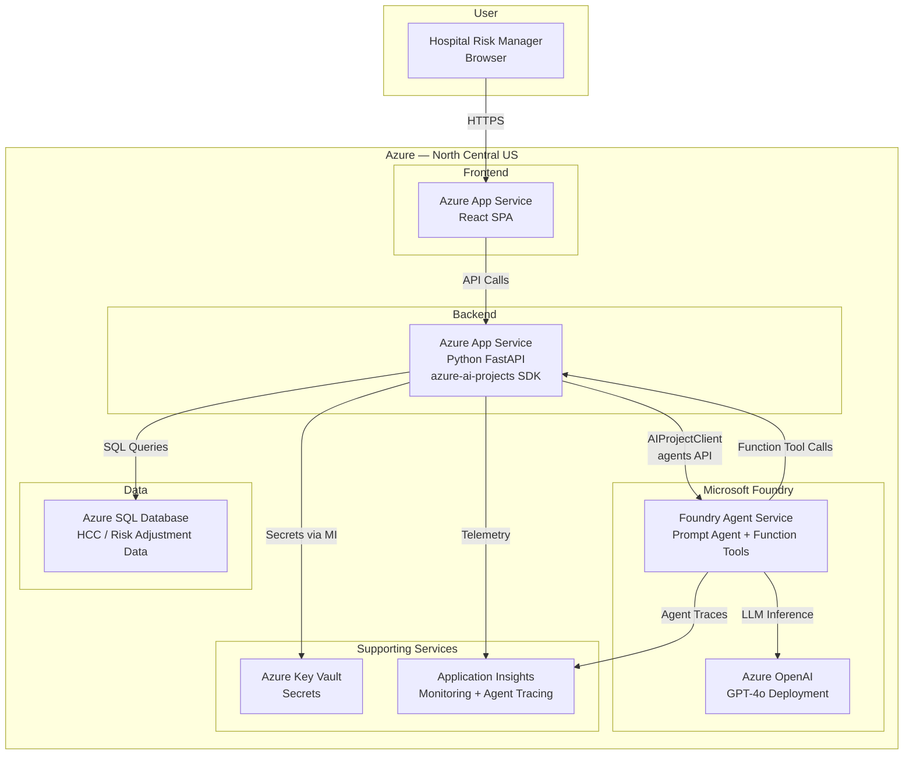
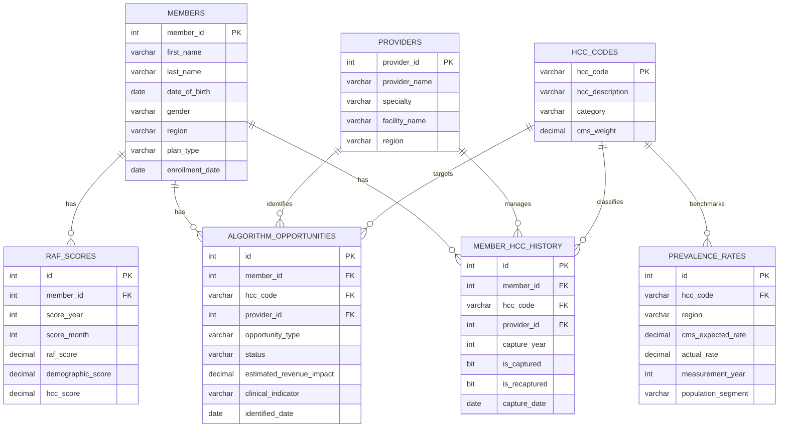

# Functional Specification: ContosoTech Healthcare Risk Analytics — AI-Powered Natural Language Query Interface

> **Customer:** ContosoTech
> **Industry:** Healthcare — Risk Adjustment Analytics
> **Prepared by:** Digital Cloud Solution Architect
> **Date:** May 20, 2026
> **Status:** Draft v2
> **SDK:** `azure-ai-projects>=2.0.0` (Microsoft Foundry Agent Service SDK)

---

## 1. Executive Summary

ContosoTech provides risk-based analysis software for hospital operations, serving hospital risk managers who monitor Hierarchical Condition Categories (HCCs), Risk Adjustment Factor (RAF) scores, recapture rates, and algorithm-based revenue and compliance opportunities. Today, these risk managers must manually review reports and perform number crunching to extract insights — a time-consuming and error-prone process.

This POC will deliver an AI-powered web application that allows hospital risk managers to ask natural language questions against their operational dataset and receive intelligent text-based answers alongside dynamically generated charts. The solution uses Microsoft Foundry agents with a text-to-SQL pattern via a **Microsoft Foundry Agent** (built with the `azure-ai-projects>=2.0.0` SDK), backed by an Azure SQL Database. Front end and APIs should be in Azure Container Apps. 

The expected outcome is a compelling, functional prototype that demonstrates how ContosoTech can modernize their analytics experience — replacing manual report review with conversational, on-demand insights. This POC will be deployable via `azd up` into ContosoTech's own Azure subscription.

---

## 2. Objectives & Success Criteria

| # | Objective | Success Criteria | Priority |
|---|-----------|-----------------|----------|
| 1 | Natural language querying | Risk managers can type plain English questions and receive accurate, relevant answers | Must-have |
| 2 | Dynamic chart generation | Query responses include appropriate charts (bar, line, pie, etc.) alongside text summaries | Must-have |
| 3 | HCC domain coverage | The system accurately handles queries across all key domain areas: recapture rates, missed opportunities, compliance opportunities, prevalence rates, and RAF scores | Must-have |
| 4 | Polished user experience | The web app is visually professional and intuitive for non-technical users | Must-have |
| 5 | One-command deployment | The entire solution deploys to a customer Azure subscription via `azd up` | Must-have |
| 6 | Synthetic data realism | Sample data is realistic enough to demonstrate value without requiring real PHI | Must-have |
| 7 | Conversation context | The system maintains context within a session so users can ask follow-up questions | Should-have |
| 8 | Query explanation | The system can explain how it arrived at an answer (show generated SQL or reasoning) | Nice-to-have |

---

## 3. Users & Personas

| Persona | Role | Interaction Model | Auth Method | Notes |
|---------|------|-------------------|-------------|-------|
| Hospital Risk Manager | Primary end user — monitors HCC performance, recapture rates, RAF scores, and identifies missed opportunities | Web app — chat-style NL query interface with charts | None (POC) — B2C planned for production | Non-technical; expects Excel/report-like familiarity. A handful per hospital. |
| ContosoTech CTO | Executive sponsor & decision maker | Reviews demo output | N/A | Evaluating feasibility and value of the AI approach |

---

## 4. Solution Architecture

### 4.1 Architecture Overview

The solution follows a **natural language to SQL (NL-to-SQL)** pattern. A React-based web application provides a chat-style interface where hospital risk managers type questions in plain English. The frontend communicates with a Python FastAPI backend, which delegates natural language understanding to a **Microsoft Foundry Agent** powered by GPT-4o.

The backend uses the **`azure-ai-projects>=2.0.0` SDK** (`AIProjectClient`) to interact with the Foundry Agent Service. The agent is configured with custom **Function Tools** — `execute_sql` and `get_schema` — that the backend implements locally. The agent translates the user's question into a safe SQL query, invokes the `execute_sql` function tool, and returns both a text summary and a chart specification. The frontend renders the chart dynamically using Recharts.

**Key SDK pattern:** The backend creates an `AIProjectClient` using a Foundry project endpoint and `DefaultAzureCredential` (Entra ID). It uses `project_client.agents` to create/manage agents, threads, messages, and runs. Function tool calls are handled via the SDK's function tool callback pattern.

### 4.2 Architecture Diagram (Mermaid)



### 4.3 Azure Services

| Service | Purpose | SKU / Tier | Region | Notes |
|---------|---------|-----------|--------|-------|
| Azure App Service (Frontend) | Host React SPA | B1 (Basic) | North Central US | Serves static React build |
| Azure App Service (Backend) | Host FastAPI API | B1 (Basic) | North Central US | Runs `azure-ai-projects` SDK, handles function tool callbacks |
| Azure OpenAI Service | LLM for NL understanding and SQL generation | Standard (GPT-4o) | North Central US (or nearest available) | Deployed as a model in the Foundry project |
| Microsoft Foundry Project | Agent orchestration and management | Standard | North Central US | Hosts the prompt agent; provides the `FOUNDRY_PROJECT_ENDPOINT` |
| Azure SQL Database | Stores HCC/risk adjustment data | Basic / S0 | North Central US | Synthetic data for POC |
| Azure Key Vault | Secrets management | Standard | North Central US | DB connection strings, Foundry endpoint |
| Application Insights | Monitoring, telemetry, and agent tracing | Pay-as-you-go | North Central US | Query performance, errors, agent execution traces |

---

## 5. Data Sources & Integration

### 5.1 Data Sources

| Source | Type | Location | Volume | Sensitivity | Access Pattern |
|--------|------|----------|--------|-------------|----------------|
| HCC Risk Adjustment Database | Azure SQL DB | Azure (provisioned as part of POC) | ~50K–100K synthetic records | PHI in production (synthetic for POC) | Read-only |

### 5.2 Data Flow

1. **Provisioning:** `azd up` deploys the Azure SQL DB and runs a seed script to populate synthetic HCC/risk adjustment data
2. **Query flow:** User question → FastAPI backend → `AIProjectClient` sends message to agent thread → Agent generates SQL → Agent calls `execute_sql` function tool → Backend executes SQL against Azure SQL DB → Results returned to agent → Agent produces text summary + chart spec
3. **Rendering:** Backend extracts structured response from agent → Frontend renders text and charts dynamically

### 5.3 Data Model

The synthetic data model mirrors ContosoTech's core domain entities:



**Key entities:**
- **Members** — Individual patients/members enrolled in risk adjustment programs
- **Providers** — Clinicians and facilities managing member care
- **HCC Codes** — CMS Hierarchical Condition Categories with associated risk weights
- **Member HCC History** — Year-over-year capture and recapture tracking per member per HCC
- **RAF Scores** — Monthly Risk Adjustment Factor scores per member (demographic + HCC components)
- **Algorithm Opportunities** — Missed revenue and compliance opportunities identified by ContosoTech's algorithms
- **Prevalence Rates** — CMS benchmark prevalence rates vs. actual rates by region and population

---

## 6. Functional Requirements

### FR-1: Natural Language Query Input

- **Description:** The system must accept free-form natural language questions from hospital risk managers and interpret them in the context of HCC risk adjustment data.
- **User Story:** As a hospital risk manager, I want to type a question in plain English so that I can get answers without writing SQL or navigating complex reports.
- **Acceptance Criteria:**
  - [ ] User can type a question in a chat-style input field
  - [ ] System interprets the question and maps it to the HCC/risk adjustment domain
  - [ ] System handles ambiguous queries gracefully with clarifying responses
  - [ ] System responds within 10 seconds for typical queries
- **Priority:** Must-have
- **Azure Services:** Azure OpenAI (GPT-4o), Foundry Agent Service

**Example queries the system should handle:**
- "What is our overall HCC recapture rate for 2026?"
- "Show me the top 10 missed revenue opportunities by estimated impact"
- "Which providers have the lowest RAF scores compared to their peers?"
- "Compare our diabetes HCC prevalence rate to the CMS benchmark in the Midwest region"
- "What is the trend of average member HCC scores over the last 12 months?"
- "How many compliance opportunities are still open by category?"

### FR-2: Text-to-SQL Generation

- **Description:** The Foundry Agent must translate natural language questions into safe, accurate SQL queries against the Azure SQL Database schema.
- **User Story:** As a risk manager, I want the system to automatically query the right data so that I don't need to understand the database structure.
- **Acceptance Criteria:**
  - [ ] Agent generates syntactically correct T-SQL for Azure SQL DB
  - [ ] Generated queries use only SELECT statements (read-only)
  - [ ] Agent uses parameterized queries to prevent SQL injection
  - [ ] Agent understands domain-specific terms (HCC, RAF, recapture, prevalence, etc.)
  - [ ] Agent references the correct tables and columns based on the question context
- **Priority:** Must-have
- **Azure Services:** Foundry Agent Service (Function Tools), Azure OpenAI, Azure SQL DB

### FR-3: Text Summary Response

- **Description:** The system must return a human-readable text summary of the query results, not just raw data.
- **User Story:** As a risk manager, I want a clear explanation of the results so that I can understand the answer without analyzing raw numbers.
- **Acceptance Criteria:**
  - [ ] Every query response includes a natural language summary
  - [ ] Summary highlights key findings, trends, or anomalies
  - [ ] Summary uses domain-appropriate language (HCC terminology, risk adjustment concepts)
  - [ ] Large result sets are summarized rather than dumped verbatim
- **Priority:** Must-have
- **Azure Services:** Azure OpenAI (GPT-4o)

### FR-4: Dynamic Chart Generation

- **Description:** The system must generate appropriate charts alongside text responses based on the nature of the query results.
- **User Story:** As a risk manager, I want to see visual charts with my answers so that I can quickly spot trends and compare values.
- **Acceptance Criteria:**
  - [ ] System selects appropriate chart type based on data shape (bar for comparisons, line for trends, pie for distributions)
  - [ ] Charts render dynamically in the web app using Recharts
  - [ ] Charts include proper labels, axes, legends, and tooltips
  - [ ] User can view the underlying data table alongside the chart
  - [ ] System gracefully handles queries where charts are not applicable (returns text only)
- **Priority:** Must-have
- **Azure Services:** Frontend (React + Recharts)

### FR-5: Conversation Context

- **Description:** The system should maintain conversation context within a session to support follow-up questions.
- **User Story:** As a risk manager, I want to ask follow-up questions like "break that down by region" without restating my original question.
- **Acceptance Criteria:**
  - [ ] System maintains conversation history within a session
  - [ ] Follow-up questions correctly reference prior context
  - [ ] User can start a new conversation to reset context
- **Priority:** Should-have
- **Azure Services:** Foundry Agent Service (thread-based conversation management via `project_client.agents`)

### FR-6: Synthetic Data Seeding

- **Description:** The POC must include a synthetic data generation script that seeds the Azure SQL DB with realistic HCC/risk adjustment data.
- **User Story:** As a CSA, I want realistic sample data so that I can demo the POC convincingly without requiring real customer data.
- **Acceptance Criteria:**
  - [ ] Seed script generates 500+ members across multiple regions
  - [ ] Generates 50+ providers across multiple specialties and facilities
  - [ ] Populates 3+ years of HCC capture/recapture history
  - [ ] Generates monthly RAF scores with realistic trends
  - [ ] Creates algorithm-based opportunities (both missed revenue and compliance)
  - [ ] Includes CMS prevalence benchmark data for comparison
  - [ ] Script runs automatically as part of `azd up` deployment
- **Priority:** Must-have
- **Azure Services:** Azure SQL DB

### FR-7: Query Explanation (Transparency)

- **Description:** The system can optionally show the user how it arrived at the answer.
- **User Story:** As a risk manager, I want to understand how the system generated its answer so that I can trust the results.
- **Acceptance Criteria:**
  - [ ] User can toggle a "Show details" option to see the generated SQL
  - [ ] Explanation is presented in a collapsible section below the answer
- **Priority:** Nice-to-have
- **Azure Services:** Frontend (React)

---

## 7. Non-Functional Requirements

| Category | Requirement | Target | Notes |
|----------|------------|--------|-------|
| Performance | Query response time (end-to-end) | < 10s p95 | Includes LLM inference + SQL execution + rendering |
| Performance | Chart rendering time | < 1s after data received | Client-side rendering with Recharts |
| Scalability | Concurrent users | 10–20 concurrent | POC scope — handful per hospital |
| Availability | Uptime target | 99.5% | Standard App Service SLA |
| Security | Data encryption | At-rest and in-transit | Azure SQL TDE + HTTPS enforced |
| Security | Read-only SQL | Only SELECT queries generated | Agent prompt engineering + validation |
| Usability | Mobile responsive | Basic responsive layout | Not primary target but should be usable |

---

## 8. AI & Intelligence

### 8.1 AI Components

| Component | Service | Model / Capability | Grounding Data | Notes |
|-----------|---------|-------------------|----------------|-------|
| NL Understanding & SQL Generation | Azure OpenAI via Foundry Agent | GPT-4o | Azure SQL DB schema + domain glossary | Text-to-SQL pattern using Function Tools |
| Response Summarization | Azure OpenAI via Foundry Agent | GPT-4o | Query results | Generates human-readable summaries |
| Chart Recommendation | Azure OpenAI via Foundry Agent | GPT-4o | Query results shape | Selects chart type and spec |

### 8.2 Agent Design (Microsoft Foundry Agent Service)

The agent is a **prompt agent** created and managed via the `azure-ai-projects>=2.0.0` SDK.

#### 8.2.1 SDK Integration Pattern

```python
import os
from azure.ai.projects import AIProjectClient
from azure.ai.projects.models import FunctionTool, ToolSet
from azure.identity import DefaultAzureCredential

# Initialize the Foundry project client
credential = DefaultAzureCredential()
project_client = AIProjectClient(
    endpoint=os.environ["FOUNDRY_PROJECT_ENDPOINT"],
    credential=credential
)

# Define function tools the agent can call
functions = FunctionTool(functions=[execute_sql_func, get_schema_func])
toolset = ToolSet()
toolset.add(functions)

# Create the agent
agent = project_client.agents.create_agent(
    model=os.environ["FOUNDRY_MODEL_NAME"],  # GPT-4o deployment name
    name="HCC Risk Analytics Assistant",
    instructions=SYSTEM_PROMPT,  # Schema + domain glossary + output format
    toolset=toolset,
    temperature=0.1,
)

# Per-session conversation flow
thread = project_client.agents.threads.create()
project_client.agents.messages.create(
    thread_id=thread.id,
    role="user",
    content=user_question,
)
run = project_client.agents.runs.create_and_process(
    thread_id=thread.id,
    agent_id=agent.id,
)
# Retrieve agent response messages
messages = project_client.agents.messages.list(thread_id=thread.id)
```

#### 8.2.2 Agent Configuration

1. **System prompt** containing:
   - Complete Azure SQL DB schema with table descriptions and column semantics
   - HCC/risk adjustment domain glossary (HCC, RAF, recapture, prevalence, etc.)
   - Instructions for generating safe, read-only T-SQL
   - Output format specification (JSON with text summary + chart spec)

2. **Function Tools available to the agent:**
   - `execute_sql` — Accepts a SQL query string; backend validates it is a SELECT, executes against Azure SQL DB, and returns results as JSON
   - `get_schema` — Returns the current database schema (table names, columns, types, descriptions) for reference

3. **Agent behavior:**
   - Parse user question and identify relevant tables/columns
   - Generate T-SQL SELECT query
   - Call `execute_sql` function tool to run the query
   - Analyze results and produce: (a) text summary, (b) chart specification JSON
   - Return structured response to the backend

4. **Thread-based conversation management:**
   - Each user session maps to a Foundry Agent thread (`project_client.agents.threads.create()`)
   - Follow-up messages are appended to the same thread, preserving conversation context
   - "New conversation" resets by creating a new thread

#### 8.2.3 Function Tool Definitions

```python
from azure.ai.projects.models import FunctionTool

execute_sql_func = {
    "name": "execute_sql",
    "description": "Execute a read-only SQL SELECT query against the Azure SQL Database and return results as JSON. Only SELECT statements are permitted.",
    "parameters": {
        "type": "object",
        "properties": {
            "query": {
                "type": "string",
                "description": "The T-SQL SELECT query to execute against the HCC risk adjustment database."
            }
        },
        "required": ["query"]
    }
}

get_schema_func = {
    "name": "get_schema",
    "description": "Return the database schema including all table names, column names, data types, and descriptions for the HCC risk adjustment database.",
    "parameters": {
        "type": "object",
        "properties": {},
        "required": []
    }
}
```

### 8.3 Agent Tracing & Observability

The `azure-ai-projects` SDK supports OpenTelemetry-based tracing that integrates with Application Insights:

```python
from azure.ai.projects.telemetry import AIProjectInstrumentor
from azure.monitor.opentelemetry import configure_azure_monitor

# Enable tracing to Application Insights
app_insights_conn = project_client.telemetry.get_application_insights_connection_string()
configure_azure_monitor(connection_string=app_insights_conn)
AIProjectInstrumentor().instrument()
```

This provides end-to-end visibility into agent execution: model calls, function tool invocations, token usage, and latency.

### 8.4 Responsible AI

- **Content filtering:** Azure OpenAI default content filters enabled (hate, self-harm, sexual, violence)
- **SQL safety:** Agent is instructed to generate only SELECT statements; backend validates generated SQL before execution as a safety layer
- **Transparency:** Optional "show SQL" feature lets users verify the query logic
- **Data minimization:** Synthetic data only for POC — no real PHI
- **Human oversight:** Results are advisory — risk managers apply their own professional judgment

---

## 9. Security & Identity

- **Authentication:** None for POC (open access). Production will use Azure AD B2C for external hospital users.
- **Authorization:** Not implemented for POC. Production will need role-based data filtering per hospital/organization.
- **Foundry Auth:** Backend authenticates to Foundry Agent Service via `DefaultAzureCredential` (Managed Identity in production, `az login` for local dev).
- **Secrets Management:** Azure Key Vault for secrets (SQL connection string, Foundry project endpoint). Accessed via Managed Identity.
- **Network Security:** Public endpoints for POC. Production should use private endpoints + VNet integration.
- **Compliance:** HIPAA compliance deferred to production phase. POC uses synthetic data only — no real PHI.
- **SQL Injection Prevention:** Agent-generated SQL is validated on the backend before execution; only SELECT statements are permitted.

---

## 10. Infrastructure & DevOps

### 10.1 Infrastructure as Code

- **IaC Tool:** Bicep
- **Deployment Tool:** Azure Developer CLI (`azd`)
- **Deployment Target:** Customer's Azure subscription (subscription ID provided at deploy time)
- **Resource Group Naming:** `rg-contosotech-hcc-poc-{environment}`
- **Environments:** Single environment (dev/demo) for POC

**Bicep resources to provision:**
- Azure AI Services account (multi-service, hosts Foundry project)
- Azure AI Foundry Project (connected to the AI Services account)
- Azure OpenAI GPT-4o model deployment (within the AI Services account)
- Azure App Service Plan (B1) with two App Services (frontend + backend)
- Azure SQL Server + Database (Basic/S0 tier)
- Azure Key Vault with Managed Identity access policies
- Application Insights workspace
- Managed Identity for App Service → Key Vault + Foundry access
- RBAC role assignments: App Service MI gets "Azure AI Developer" role on the Foundry project

**Customer deployment instructions:**
```bash
# Prerequisites: Azure CLI, Azure Developer CLI (azd), Node.js 20+, Python 3.12+
# 1. Clone the repository
git clone <repo-url>
cd contosotech-hcc-poc

# 2. Log in to Azure
azd auth login
az login

# 3. Configure environment
azd init
# When prompted, provide:
#   - Environment name (e.g., "demo")
#   - Azure subscription ID
#   - Azure region (default: northcentralus)

# 4. Deploy everything
azd up
# This provisions all Azure resources, deploys the app, and seeds the database
```

### 10.2 CI/CD Pipeline

- **Platform:** GitHub Actions
- **Stages:** Lint → Build → Test → Deploy
- **Branch Strategy:** `main` branch only for POC
- **Triggers:** Push to `main`, manual dispatch

### 10.3 Monitoring & Observability

| Component | Tool | Purpose |
|-----------|------|---------|
| Application | Application Insights | API performance, query latency, error rates, user sessions |
| AI Agent | Application Insights + `AIProjectInstrumentor` | Agent execution traces, function tool calls, token usage, SQL generation accuracy |
| Infrastructure | Azure Monitor | Resource health, CPU/memory, SQL DTU usage |

---

## 11. Scope & Constraints

### 11.1 In Scope
- Polished React web app with chat-style natural language query interface
- Dynamic chart generation (bar, line, pie) from query results
- Azure OpenAI GPT-4o text-to-SQL via Foundry Agent Service (`azure-ai-projects>=2.0.0`)
- Azure SQL Database with synthetic HCC/risk adjustment data
- Synthetic data generation script (members, providers, HCCs, RAF scores, opportunities, prevalence)
- Bicep infrastructure-as-code for full deployment via `azd up` (including Foundry project + agent provisioning)
- GitHub Actions CI/CD pipeline
- Application Insights monitoring with agent tracing
- Conversation context within a session (Foundry Agent threads)

### 11.2 Out of Scope
- Authentication and authorization (B2C, RBAC) — deferred to production
- Real PHI data — synthetic data only
- HIPAA compliance hardening (encryption policies, audit controls, BAA)
- Private networking (VNet, private endpoints)
- Multi-tenancy (hospital-level data isolation)
- Data export or download functionality
- Role-based data filtering
- Audit logging
- Mobile-native application
- Integration with existing ContosoTech systems
- Data migration from ContosoTech's current systems

### 11.3 Assumptions
- ContosoTech has an Azure subscription available for deployment
- The CTO has authority to approve Azure resource provisioning
- The synthetic data model is representative enough of ContosoTech's actual schema to demonstrate value
- Azure OpenAI GPT-4o is available in North Central US (or an adjacent region)
- Microsoft Foundry Agent Service is available in North Central US
- ContosoTech's actual production data in Azure SQL DB follows a similar relational structure

### 11.4 Risks & Mitigations

| Risk | Impact | Likelihood | Mitigation |
|------|--------|-----------|------------|
| GPT-4o generates incorrect SQL for complex queries | High | Medium | Extensive domain context in agent prompt; SQL validation layer; "show SQL" transparency feature |
| Synthetic data doesn't represent real data well enough | Medium | Medium | Work with ContosoTech CTO to validate schema and data patterns before demo |
| Azure OpenAI regional availability in North Central US | Low | Low | Fall back to East US 2 with cross-region API calls |
| Query latency exceeds 10s for complex joins | Medium | Medium | Optimize synthetic data indexing; add query timeout with user-friendly message |
| Customer expects production-ready solution from POC | High | Medium | Clear scope documentation; explicit out-of-scope section; position as Phase 1 |
| Foundry Agent Service regional availability | Low | Low | Fall back to East US 2; agent service supports cross-region model deployments |

---

## 12. Timeline & Milestones

| Milestone | Description |
|-----------|------------|
| Kickoff | Spec review with ContosoTech CTO; confirm synthetic data model |
| Environment Ready | Bicep templates complete; `azd up` provisions all resources including Foundry project |
| Data Seeding | Synthetic data generation script complete and validated |
| Core AI Pipeline | Foundry Agent created via SDK; text-to-SQL working with function tools for representative queries |
| Frontend MVP | React app with chat UI and basic chart rendering |
| Integration Complete | End-to-end flow working: question → agent thread → SQL → answer + chart |
| Polish & Demo | UI refinements, error handling, demo prep |
| Customer Demo | Live demo with ContosoTech CTO |

---

## 13. Appendix

### 13.1 Glossary

| Term | Definition |
|------|-----------|
| **HCC** | Hierarchical Condition Category — CMS risk adjustment classification for chronic conditions |
| **RAF Score** | Risk Adjustment Factor — a numeric score representing a member's predicted healthcare costs relative to average |
| **Recapture Rate** | Percentage of HCCs identified in prior years that are successfully re-documented in the current year |
| **Missed Opportunity** | An HCC that clinical/lab data suggests should exist but hasn't been documented and submitted |
| **Compliance Opportunity** | A coding or documentation issue identified by compliance algorithms |
| **Prevalence Rate** | Expected rate of a condition in a population, per CMS benchmarks |
| **CMS** | Centers for Medicare & Medicaid Services |
| **qrcAnalytics** | ContosoTech's analytics platform |
| **Text-to-SQL** | AI pattern where natural language is translated into SQL queries |
| **Foundry Agent** | Microsoft Foundry Agent — a managed AI agent with tools, hosted by Foundry Agent Service |
| **AIProjectClient** | The main client class from `azure-ai-projects` SDK for interacting with Foundry projects |
| **Function Tool** | A custom function exposed to the agent that it can invoke during reasoning (e.g., `execute_sql`) |
| **FOUNDRY_PROJECT_ENDPOINT** | The Foundry project endpoint URL used by `AIProjectClient` for authentication and API access |

### 13.2 References

- [Microsoft Foundry Agent Service Overview](https://learn.microsoft.com/azure/foundry/agents/overview)
- [azure-ai-projects SDK (PyPI)](https://pypi.org/project/azure-ai-projects/)
- [azure-ai-projects SDK Documentation](https://learn.microsoft.com/python/api/overview/azure/ai-projects-readme)
- [Foundry Agent SDK Samples](https://aka.ms/azsdk/azure-ai-projects-v2/python/samples/)
- [Azure OpenAI Service Documentation](https://learn.microsoft.com/azure/ai-services/openai/)
- [Azure SQL Database Documentation](https://learn.microsoft.com/azure/azure-sql/database/)
- [Azure Developer CLI (azd)](https://learn.microsoft.com/azure/developer/azure-developer-cli/)
- [Recharts — React Charting Library](https://recharts.org/)
- [CMS Risk Adjustment Overview](https://www.cms.gov/medicare/payment/medicare-advantage-rates-statistics/risk-adjustment)

### 13.3 GitHub Copilot Implementation Notes

> **Instructions for GitHub Copilot / AI-assisted development:**
>
> This specification is designed to be used as context for code generation. When loaded into GitHub Copilot or a Copilot Workspace:
>
> 1. **Infrastructure (Bicep):** Generate Bicep templates for all services listed in Section 4.3. Use the SKUs, regions, and configurations specified. Include:
>    - Azure AI Services account (multi-service cognitive services resource)
>    - Azure AI Foundry Hub + Project (connected to the AI Services account)
>    - Azure OpenAI GPT-4o model deployment (within the AI Services account)
>    - Azure App Service Plan (B1) with two App Services (frontend + backend)
>    - Azure SQL Server + Database (Basic/S0 tier)
>    - Azure Key Vault with Managed Identity access policies
>    - Application Insights workspace (Log Analytics)
>    - User-assigned Managed Identity with RBAC:
>      - "Azure AI Developer" role on the Foundry project
>      - "Key Vault Secrets User" on Key Vault
>    - All resources in North Central US
>
> 2. **Backend (Python FastAPI) — using `azure-ai-projects>=2.0.0`:**
>    - Python 3.12 with FastAPI framework
>    - **Key dependency:** `azure-ai-projects>=2.0.0` (Microsoft Foundry Agent Service SDK)
>    - **Additional dependencies:** `azure-identity`, `pyodbc` (or `aioodbc`), `fastapi`, `uvicorn`
>    - Endpoints: `POST /api/query` (accepts NL question, returns text + chart spec), `GET /api/health`
>    - Initialize `AIProjectClient` with `FOUNDRY_PROJECT_ENDPOINT` and `DefaultAzureCredential`
>    - Create agent on startup via `project_client.agents.create_agent()` with:
>      - `model`: GPT-4o deployment name from env var `FOUNDRY_MODEL_NAME`
>      - `name`: "HCC Risk Analytics Assistant"
>      - `instructions`: system prompt with full schema + domain glossary
>      - `toolset`: `FunctionTool` with `execute_sql` and `get_schema` functions
>      - `temperature`: 0.1
>    - Per-request flow:
>      1. Create or reuse a thread (`project_client.agents.threads.create()`)
>      2. Add user message (`project_client.agents.messages.create()`)
>      3. Run agent (`project_client.agents.runs.create_and_process()`)
>      4. Handle function tool calls: validate SQL is SELECT-only, execute via pyodbc, return results
>      5. Retrieve response messages (`project_client.agents.messages.list()`)
>      6. Parse structured response (text + chart JSON)
>    - SQL validation layer — reject any non-SELECT statements before execution
>    - Structured response format: `{ "text": "...", "chart": { "type": "bar|line|pie", "data": [...], "config": {...} }, "sql": "..." }`
>    - Enable agent tracing: `AIProjectInstrumentor().instrument()` with Application Insights
>    - Session/thread management for conversation context via Foundry Agent threads
>
> 3. **Frontend (React):**
>    - React 18+ with TypeScript
>    - Chat-style UI with message bubbles (user questions + AI responses)
>    - Recharts for dynamic chart rendering based on chart spec from backend
>    - Collapsible "Show SQL" panel per response
>    - New conversation button to reset context
>    - Responsive layout with a clean, professional healthcare-appropriate design
>    - Suggested starter questions on the landing screen (e.g., "What is our recapture rate?", "Show top missed opportunities")
>
> 4. **Synthetic Data:**
>    - SQL seed script (`seed-data.sql`) that runs during `azd up` post-provisioning
>    - Generate: 500+ members, 50+ providers, 30+ HCC codes, 3 years of history
>    - Realistic distributions: RAF scores between 0.5–4.0, recapture rates 60–85%, regional variation
>    - Algorithm opportunities with mix of "identified", "in-review", "resolved" statuses
>    - Prevalence rates based on approximate CMS benchmarks
>
> 5. **Foundry Agent Configuration (via SDK):**
>    - Agent name: "HCC Risk Analytics Assistant"
>    - Created programmatically at backend startup via `project_client.agents.create_agent()`
>    - System prompt includes: full SQL schema, domain glossary, output format instructions
>    - Function Tools: `execute_sql` (runs parameterized query), `get_schema` (returns table definitions)
>    - Model: GPT-4o (referenced by deployment name via `FOUNDRY_MODEL_NAME` env var)
>    - Temperature: 0.1 (low for SQL accuracy)
>    - Agent ID cached after creation; reused across requests
>
> 6. **Authentication & Security:**
>    - `DefaultAzureCredential` for all Azure service authentication (Foundry, Key Vault, SQL)
>    - Managed Identity for App Service → Key Vault + Foundry project access
>    - Key Vault for SQL connection string and Foundry project endpoint
>    - HTTPS enforced on all endpoints
>    - No user authentication for POC (noted for future B2C integration)
>
> 7. **DevOps:**
>    - `azure.yaml` for azd with hooks for database seeding
>    - GitHub Actions workflow: lint (ruff + eslint), build, deploy
>    - `.env.sample` with all required configuration variables documented:
>      ```
>      FOUNDRY_PROJECT_ENDPOINT=https://<ai-services>.services.ai.azure.com/api/projects/<project-name>
>      FOUNDRY_MODEL_NAME=gpt-4o
>      AZURE_SQL_CONNECTION_STRING=...
>      APPLICATIONINSIGHTS_CONNECTION_STRING=...
>      ```
>
> 8. **Testing:**
>    - Backend: pytest tests for SQL validation, query endpoint, agent response parsing
>    - Frontend: Jest + React Testing Library for core component tests
>    - Integration: Test representative queries from FR-1 example list
>
> **Technology Stack:**
> - Language/Runtime: Python 3.12 (backend), Node.js 20+ / TypeScript (frontend)
> - Framework: FastAPI (backend), React 18 + Recharts (frontend)
> - AI SDK: `azure-ai-projects>=2.0.0` + `azure-identity`
> - IaC: Bicep
> - Deployment: Azure Developer CLI (azd)
> - CI/CD: GitHub Actions
